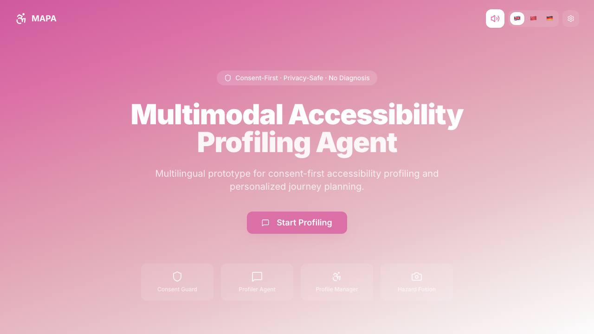
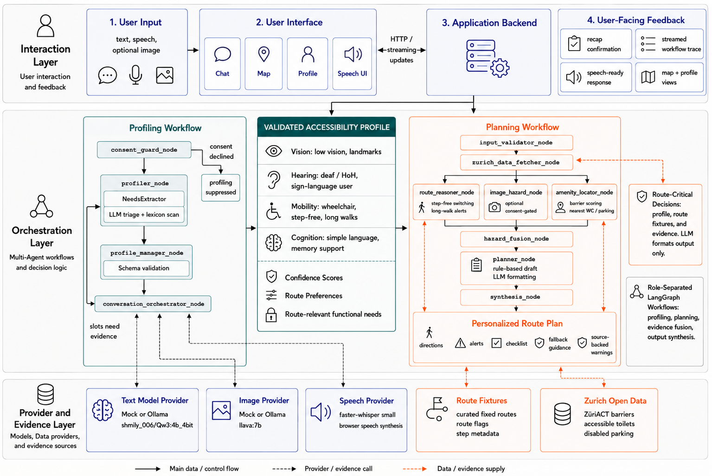

# MAPA: Accessibility Profiling and Personalized Journey Planning

<p align="center">
  
</p>

MAPA (Multimodal multi-Agent Profiling for Accessibility) is the prototype developed for the thesis **Accessibility Profiling and Personalized Journey Planning: A Multimodal Multi-Agent LLM-Based Framework**.

The system asks the user for permission, collects practical needs for a route, such as step-free access, spoken or written guidance, simple wording, and landmark support, and stores them as a checked JSON profile. The confirmed profile is then used to adapt fixed route examples and add selected City of Zurich open data. This repository contains the code and evaluation files used for thesis review.

## System Overview



## Thesis Review Version

The reviewed thesis version should be cited from a fixed Git tag or GitHub release. After the submission deadline, keep that tagged version unchanged. If development continues after submission, use a new branch, a new release tag, or a separate repository.

Suggested release tag for the submitted version:

```bash
git tag -a thesis-submission-2026-07-01 -m "Thesis submission review version"
git push origin thesis-submission-2026-07-01
```

## Repository Contents

| Path | Purpose |
| --- | --- |
| `backend/` | API, profile and planning pipelines, providers, schemas, and evaluation code |
| `frontend/` | Browser interface for consent, profiling, route planning, speech controls, and map display |
| `results/` | Generated evaluation reports, case-level CSV files, and LaTeX table fragments used in the thesis |
| `docs/` | API contract, implementation notes, Zurich open-data integration report, and README assets |
| `skills/` | Agent responsibility notes used during staged implementation |
| `pipeline_workflow.html` | Interactive overview of the profile and planning pipelines |

## Main Features

- short profiling dialogue with permission, skip, and confirmation steps
- validated `accessibility_profile` JSON representation for vision, hearing, mobility, and cognition needs
- deterministic mock mode for offline evaluation
- optional local text and vision model providers
- route planning over fixed route fixtures: `route_with_stairs`, `step_free_route`, and `long_walk_route`
- City of Zurich open-data enrichment for accessibility barriers, toilets, and parking where coordinates are available
- REST and Server-Sent Events endpoints for profile and planning calls
- browser frontend with Mock, local model, and Backend modes

## Quick Start

Create the Python environment and install dependencies:

```bash
python -m venv .venv
source .venv/bin/activate
pip install -r requirements.txt
```

Run the backend:

```bash
uvicorn backend.app.api:app --reload --port 8000
```

Run the frontend:

```bash
cd frontend
npm install
npm run dev
```

The default mode is deterministic and offline. Local model calls are optional.

## API Endpoints

| Method | Path | Description |
| --- | --- | --- |
| `GET` | `/api/health` | Health check |
| `GET` | `/api/routes` | List route fixtures |
| `GET` | `/api/zurich/data` | Fetch Zurich barrier, toilet, and parking data near a point |
| `POST` | `/api/audio/transcribe` | Upload microphone audio for transcription |
| `POST` | `/api/profile/turn` | Profile dialogue turn |
| `POST` | `/api/profile/stream` | Streaming profile dialogue turn |
| `POST` | `/api/plan` | Create a personalized route plan |
| `POST` | `/api/plan/stream` | Streaming plan generation with per-node progress |

See `docs/API_CONTRACT.md` for request and response shapes.

## Evaluation Artifacts

The thesis evaluation artifacts are stored in `results/`.

| File | Content |
| --- | --- |
| `experiment_report.json` | Full generated report for profiling, planning, boundary, and indoor-style adaptation experiments |
| `profiling_cases.csv` | Case-level profiling outputs and label scores |
| `planning_cases.csv` | Case-level planning outputs across baseline and profile-conditioned settings |
| `boundary_planning_cases.csv` | Boundary cases for fallback warnings and unsupported accessibility claims |
| `indoor_adaptation_cases.csv` | Indoor-style persona adaptation cases |
| `table_*.tex` | LaTeX table fragments included in the thesis |

Run the evaluation harness:

```bash
python -m backend.app.evaluation.run_eval
```

Run the test suite:

```bash
pytest -q
```

## Local Models

The mock providers are sufficient for deterministic review. To try the local model mode, start a local model server and use the model names configured in the backend provider settings.

```bash
ollama serve
ollama pull qwen3.5:4b
ollama pull llava:7b
```

## Citation

Use the repository citation metadata in `CITATION.cff`, or cite the review release once the thesis submission tag has been pushed.

## License

This repository is released for thesis review and academic non-commercial reuse with attribution. See `LICENSE` for the full terms.
